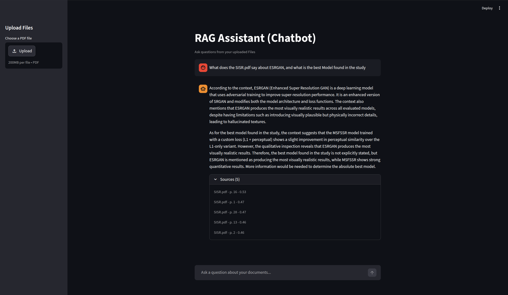

# Student Assistant PDFs

This project is a small RAG-based assistant for chatting with uploaded PDF documents.

It includes:
- a FastAPI backend for upload, document processing, retrieval, and answer generation
- a Streamlit frontend for uploading files and asking questions
- a local Chroma vector store for document chunks and embeddings

## Project Structure

```text
.
├── backend/
│   └── app/
│       ├── main.py
│       ├── data/
│       └── src/
├── frontend/
│   └── app.py
├── imgs/
└── notebooks/
```

## How It Works

1. Upload a PDF from the Streamlit interface.
2. The backend loads the file, splits it into chunks, and generates embeddings.
3. The chunks are stored in a local Chroma vector database.
4. When a question is asked, the backend runs retrieval and sends the selected context to the LLM.
5. The answer is returned in the chat UI with compact source references.

## Architecture


## Frontend



## Run Locally

You need Python installed and a valid `GROQ_API_KEY` in your environment.

Backend:

```bash
cd backend/app
uvicorn main:app --reload
```

Frontend:

```bash
cd frontend
streamlit run app.py
```

Default local URLs:
- backend: `http://localhost:8000`
- frontend: `http://localhost:8501`

## Notes

- Uploaded files are stored under `backend/app/data/upload`
- The vector store is stored under `backend/app/data/vector_store`
- This project is currently a RAG pipeline with routing and hybrid retrieval

## Status

This is still a working project, so some parts are being improved as the pipeline evolves.
